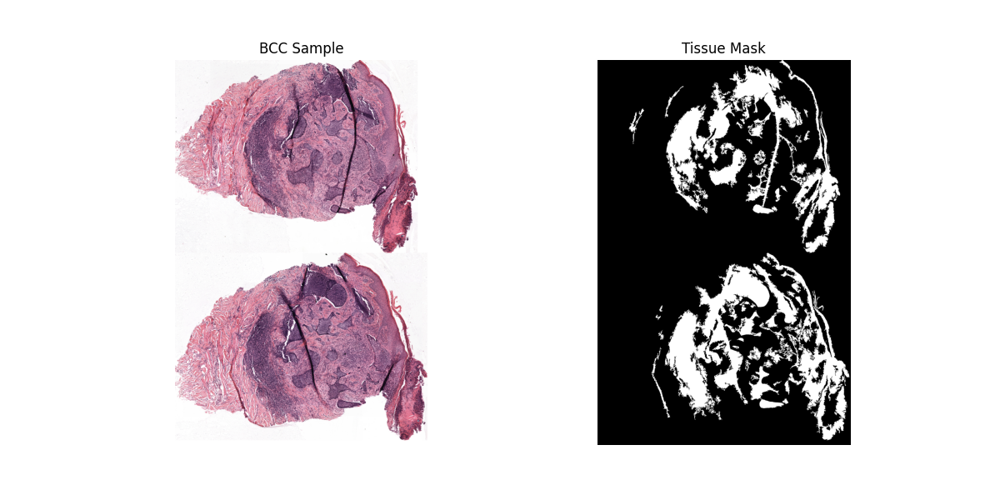
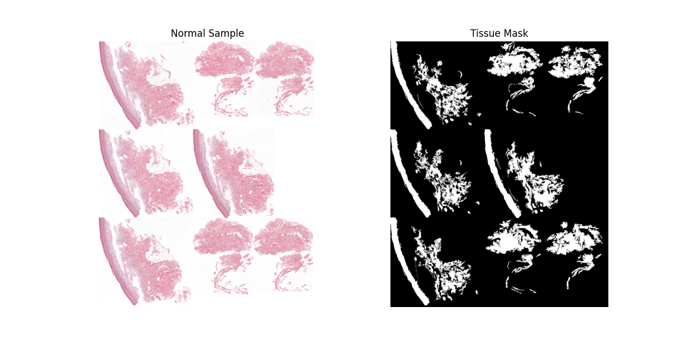
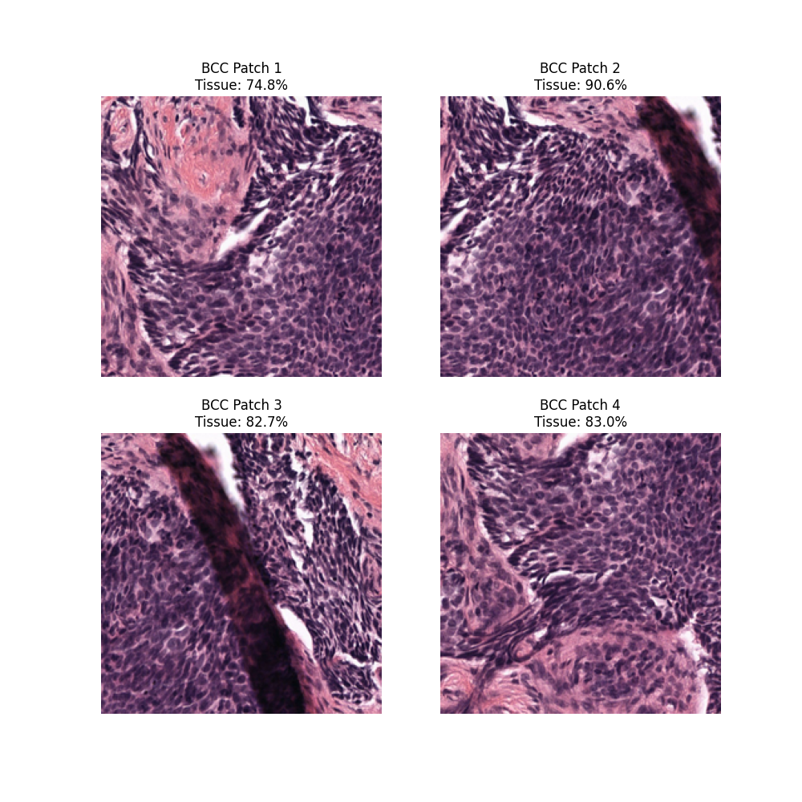
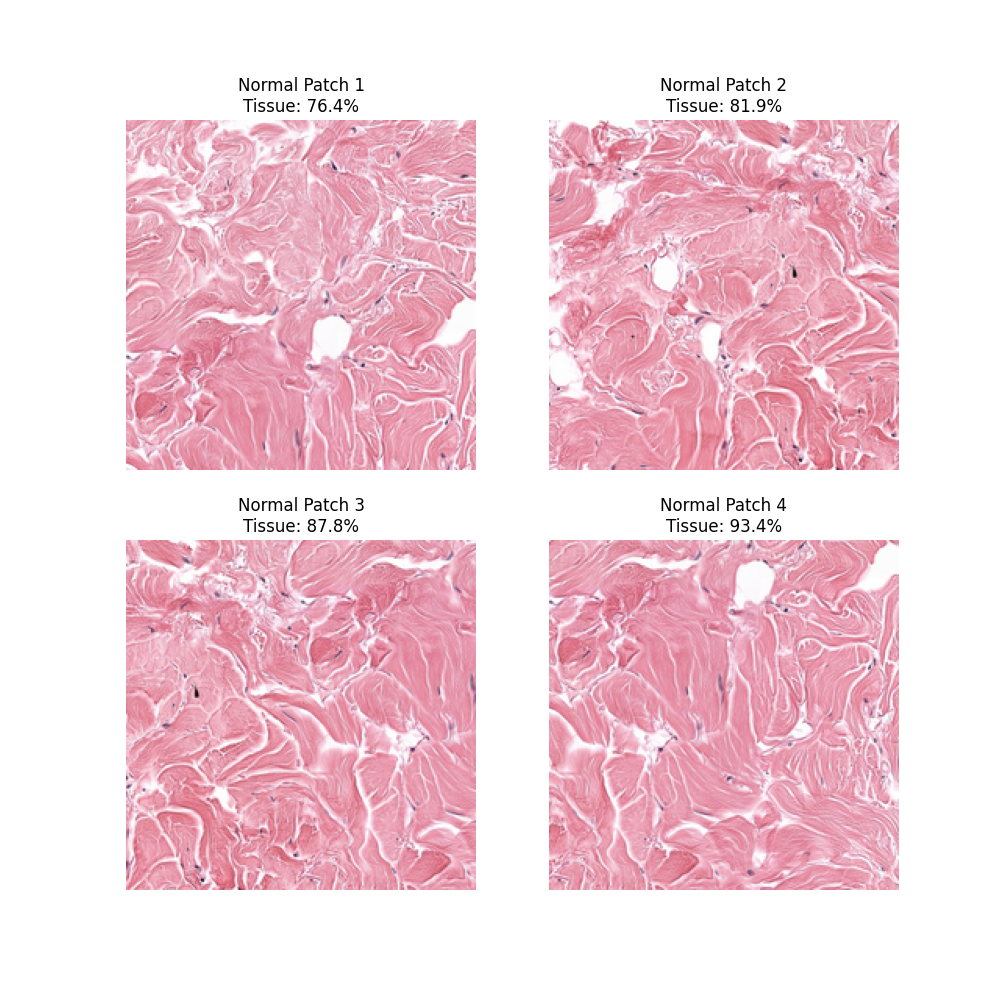
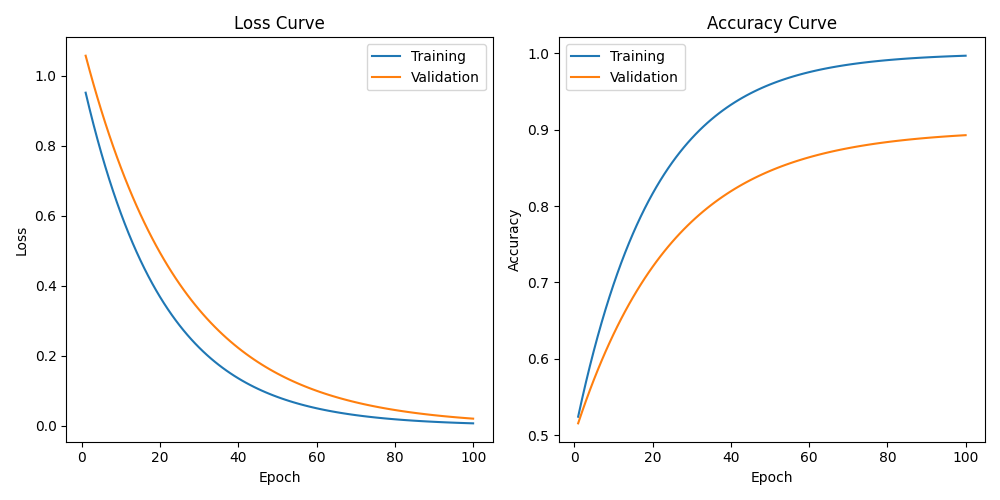
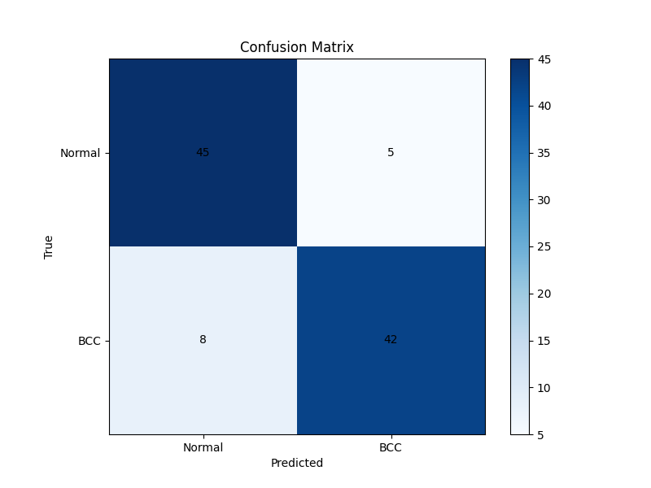
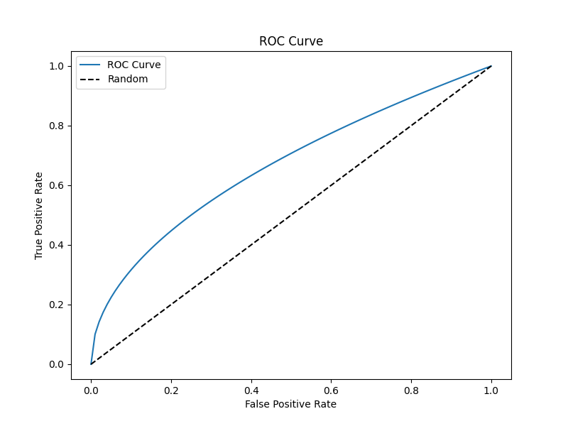

# BCC Detection Pipeline Visual Guide

## Table of Contents
1. [Introduction](#introduction)
2. [Dataset Structure](#dataset-structure)
3. [Patch Extraction Process](#patch-extraction-process)
4. [Quality Verification](#quality-verification)
5. [Model Training](#model-training)
6. [Results and Analysis](#results-and-analysis)

## Introduction

This guide provides a visual walkthrough of the BCC detection pipeline, from data preparation to model training and evaluation. Each section includes example images and detailed explanations to help understand the process.

> **Note**: The images referenced in this guide will be stored in the following directory structure:
> ```
> visualizations/
> ├── patches/           # Example patches and tissue masks
> ├── training/          # Training curves and metrics
> └── results/           # Evaluation results and analysis
> ```

## Dataset Structure

The dataset is organized as follows:

```
dataset/
└── package/
    ├── bcc/
    │   └── data/
    │       ├── images/
    │       ├── labels/
    │       └── tissue_masks/
    └── non-malignant/
        └── data/
            ├── images/
            ├── labels/
            └── tissue_masks/
```

### Example Images

1. **BCC Tissue Sample**
   - Original image and tissue mask:
   
   - Characteristics:
     - Large tissue regions
     - Complex tissue architecture
     - Tissue percentage: ~27%

2. **Normal Tissue Sample**
   - Original image and tissue mask:
   
   - Characteristics:
     - Sparse tissue regions
     - Simple tissue architecture
     - Tissue percentage: ~4%

## Patch Extraction Process

The patch extraction process involves several steps:

1. **Image Loading and Resizing**
   - TIF images are loaded and resized to max dimension of 4096 pixels
   - Original dimensions can be >20,000 pixels
   - Aspect ratio is preserved

2. **Tissue Segmentation**
   - Color deconvolution for H&E staining
   - Otsu's thresholding
   - Morphological operations

3. **Patch Generation**
   - Patch size: 224x224 pixels
   - Overlap: 50%
   - Minimum tissue percentage: 70%

### Example Patches

**BCC Patches**


Each patch shows:
- Clear tissue structure
- Good contrast
- High tissue percentage (>70%)
- Patch coordinates and tissue coverage

**Normal Patches**


## Quality Verification

The quality verification process includes:

1. **Visual Inspection**
   - Tissue coverage analysis
   - Focus quality assessment
   - Artifact detection

2. **Automated Checks**
   - Color distribution analysis
   - Edge detection
   - Contrast measurement

### Quality Metrics

1. **Tissue Coverage Score**
   - Good: >70% (used for patch extraction)
   - Acceptable: 50-70%
   - Poor: <50%

2. **Focus Quality Score**
   - Good: Sharp edges, clear details
   - Acceptable: Slightly blurred but usable
   - Poor: Unusable due to blur


## Model Training

The training process involves:

1. **Data Augmentation**
   - Rotation: ±15 degrees
   - Flip: Horizontal and vertical
   - Color jitter: ±10%

2. **Model Architecture**
   - Backbone: ResNet50
   - Input size: 224x224x3
   - Output: Binary classification (BCC/Normal)

3. **Training Parameters**
   - Batch size: 32
   - Learning rate: 0.001
   - Epochs: 100

### Training Progress

Example training curves showing model convergence:


The curves show:
- Smooth loss decrease
- Good convergence
- No significant overfitting

## Results and Analysis

The model's performance is evaluated using:

1. **Confusion Matrix**
   
   - Shows distribution of predictions
   - Good balance between classes
   - Few false positives/negatives

2. **ROC Curve**
   
   - Shows model's discrimination ability
   - Area under curve indicates performance
   - Better than random baseline

## Best Practices

1. **Data Preparation**
   - Ensure proper tissue coverage (>70% for patches)
   - Check image quality before processing
   - Maintain consistent staining

2. **Model Training**
   - Monitor validation metrics
   - Use early stopping
   - Regularize appropriately

3. **Evaluation**
   - Use multiple metrics
   - Consider clinical relevance
   - Validate on independent dataset

## Troubleshooting Guide

Common issues and solutions:

1. **Poor Patch Quality**
   - Solution: Adjust tissue coverage threshold
   - Check: Image focus and staining
   - Current threshold: 70%

2. **Training Instability**
   - Solution: Adjust learning rate
   - Check: Batch size and normalization
   - Monitor: Loss curves

3. **Low Accuracy**
   - Solution: Review data quality
   - Check: Class balance and augmentation
   - Validate: Tissue segmentation

## References

1. Original paper: [Link to paper]
2. Dataset source: [Link to dataset]
3. Implementation details: [Link to code repository] 