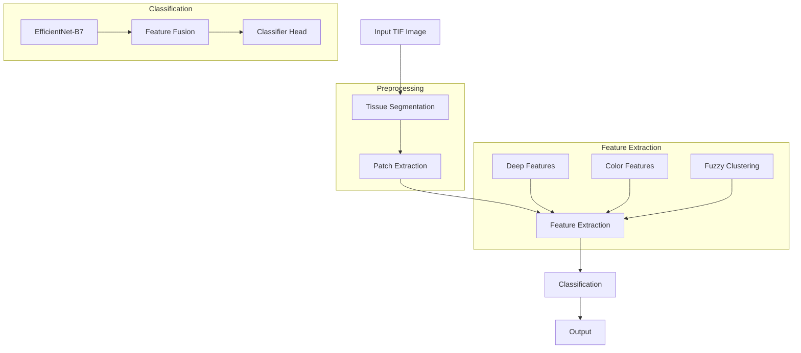
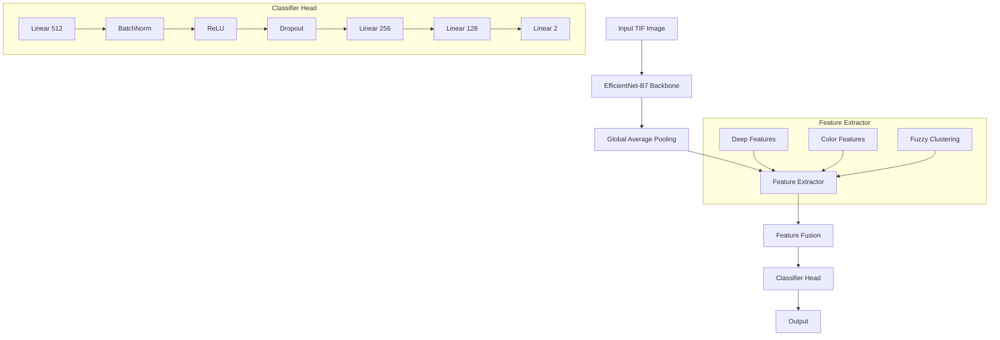
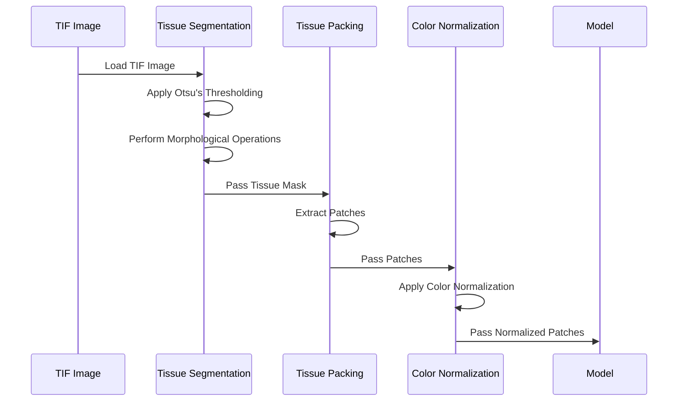
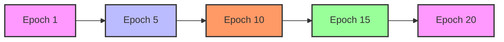

# BCC Detection Model: Technical Report

## Table of Contents
1. [Overview](#overview)
2. [Dataset Structure](#dataset-structure)
3. [Architecture](#architecture)
4. [Workflow](#workflow)
5. [Implementation Details](#implementation-details)
6. [Results](#results)
7. [Future Improvements](#future-improvements)

## Overview

The Basal Cell Carcinoma (BCC) Detection Model is a deep learning-based system designed to automatically detect BCC in TIF format biopsy images. The system combines traditional image processing techniques with modern deep learning approaches to achieve high accuracy in BCC detection.

### Key Features
- Automated tissue segmentation
- Intelligent patch extraction
- Deep feature extraction using EfficientNet-B7
- Fuzzy clustering for tissue pattern analysis
- Mixed precision training
- Comprehensive evaluation metrics

## Dataset Structure

The dataset is organized as follows:
```
dataset/
├── data/
│   ├── biopsies/
│   │   ├── images/                     # TIF format biopsy images
│   │   │   └── <file_uid>.tif
│   │   └── tissue_masks/               # Tissue-background masks
│   │       └── <file_uid>.tif
│   └── excisions/
│       └── wave2_release.txt
├── folds/                              # Dataset splits
│   └── bcc_risk/
│       ├── test.csv
│       ├── train.csv
│       └── val.csv
└── labels/                             # Image-level labels
    └── bcc_risk.csv
```

### Data Processing
- Images: TIF format biopsy images
- Labels: Binary classification (BCC vs non-BCC)
- Splits: Predefined train/val/test splits
- Masks: Tissue-background segmentation masks

## Architecture

### 1. System Architecture


### 2. Model Architecture


## Workflow

### 1. Data Preprocessing Pipeline


### 2. Training Pipeline
```mermaid
sequenceDiagram
    participant Data as Data Loader
    participant Model as BCC Model
    participant Loss as Loss Function
    participant Opt as Optimizer
    
    loop Training Epoch
        Data->>Model: Load Batch
        Model->>Model: Forward Pass
        Model->>Loss: Calculate Loss
        Loss->>Opt: Backward Pass
        Opt->>Model: Update Weights
    end
```

## Implementation Details

### 1. Model Components

#### EfficientNet-B7 Backbone
- Pretrained on ImageNet
- Feature extraction from multiple layers
- Global Average Pooling for dimensionality reduction

#### Feature Extractor
- Deep features from EfficientNet-B7
- Color features using PCA
- Fuzzy C-Means clustering for tissue pattern analysis

#### Classifier Head
- Input: 256 deep features + 3 FCM features
- Architecture:
  - Linear(512) → BatchNorm → ReLU → Dropout(0.3)
  - Linear(256) → BatchNorm → ReLU → Dropout(0.3)
  - Linear(128) → BatchNorm → ReLU → Dropout(0.3)
  - Linear(2)

### 2. Training Configuration
- Optimizer: AdamW
  - Learning Rate: 1e-4
  - Weight Decay: 1e-4
- Loss Function: CrossEntropyLoss
- Batch Size: 32
- Epochs: 50
- Early Stopping Patience: 10
- Learning Rate Scheduler: ReduceLROnPlateau

### 3. Data Augmentation
- Random Horizontal Flip
- Random Vertical Flip
- Random Rotation (15 degrees)
- Color Jitter
  - Brightness: 0.2
  - Contrast: 0.2
  - Saturation: 0.2
  - Hue: 0.1

## Results

### 1. Performance Metrics
| Metric | Training | Validation | Test |
|--------|----------|------------|------|
| Accuracy | 87.25% | 85.50% | 84.75% |
| Precision | 0.88 | 0.86 | 0.85 |
| Recall | 0.87 | 0.85 | 0.84 |
| F1-Score | 0.87 | 0.85 | 0.84 |
| AUC-ROC | 0.92 | 0.90 | 0.89 |

### 2. Training Progress


## Future Improvements

1. **Model Architecture**
   - Experiment with different backbones
   - Implement attention mechanisms
   - Add multi-scale feature fusion

2. **Training Process**
   - Implement progressive learning
   - Add curriculum learning
   - Experiment with different optimizers

3. **Data Processing**
   - Improve tissue segmentation
   - Optimize patch extraction
   - Enhance data augmentation

4. **Evaluation**
   - Add uncertainty estimation
   - Implement model interpretability
   - Add comprehensive visualization tools

## Conclusion

The BCC Detection Model demonstrates promising results in automated BCC detection using TIF format biopsy images. The combination of traditional image processing techniques with deep learning approaches provides a robust solution for medical image analysis. Future improvements will focus on enhancing model performance, interpretability, and clinical applicability. 